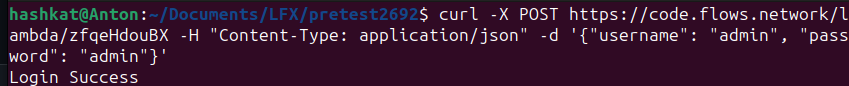
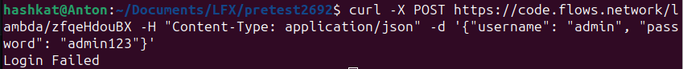

# Simple Login Handler

The purpose of this project is to demonstrate a simple login handler written in rust and deployed on the flows network.
The project compares the given username and password sent by a POST request where the body is the JSON object:

```json
{
    "username": "username",
    "password": "password"
}
```

```bash
curl -X POST https://code.flows.network/lambda/zfqeHdouBX -H "Content-Type: application/json" -d '{"username": "admin", "password": "admin"}'
```

will return


and 
```bash
curl -X POST https://code.flows.network/lambda/zfqeHdouBX -H "Content-Type: application/json" -d '{"username": "admin", "password": "admin123"}'
```

will return


Similarly multiple user support can be added with the help of a MySQL connection and a new register handler route.